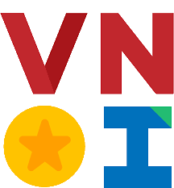
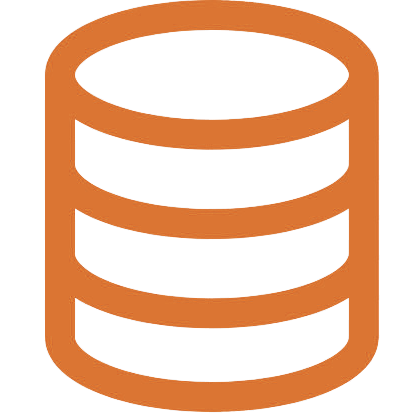
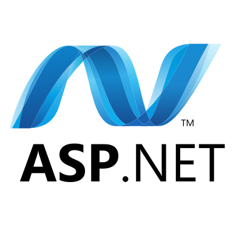
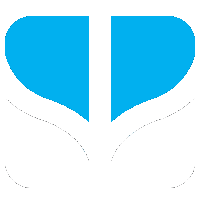

<h1 align="left">Hi 👋, I'm Thành</h1>
<h3 align="left">Computer Science student at UET-VNU</h3>

  
  
  

- 🌱 I am currently learning  **Computer Science** at  [**VNU-UET**](https://uet.vnu.edu.vn/).
- 📍 I am living and studying in  **Hanoi, Vietnam**.
- 🎯 My main interests are  **Software Engineering** and  **Research**.
- 👯 I am looking to collaborate on  **open-source projects**.
- 💬 Ask me about  **everything (but not frontend)**.
- ⚡ I accidentally built a  **game engine** while working on [**The Floor is Rhythm**](https://youtu.be/1eFJ12o5hNc).

## 🏆 Competitive Programming Profiles

-  LeetCode: [thnhmai06](https://www.leetcode.com/thnhmai06)
-  VNOI: [MaiThanh1342](https://oj.vnoi.info/user/MaiThanh1342)

## 🌐 Connect With Me

  
  
  
  

  
## 📌 Discord Presence:

## 🚀 Current Focus

- Strengthening core CS fundamentals and algorithmic thinking.
- Building practical projects with clean architecture.
- Improving code quality, maintainability, and performance.
- Learning to use AI tools effectively for development and problem-solving.

## 🧰 Tech Stack

  <h3><i>programming languages</i></h3>
  

    
    
    
    
    
    
    
    
    
    
  

  <h3><i>frameworks & libraries</i></h3>
  

    
    
    
    
    
    
    
    
    
    
    
  

  <h3><i>os & tools</i></h3>
  

    
    
    
    
    
    
  

  <h3><i>ides</i></h3>
  

    
    
    
    
    
    
    
    
  

  <h3><i>others</i></h3>
  

    
    
    
    
    
    
  

## 📊 Statistics

    
    
    
    

